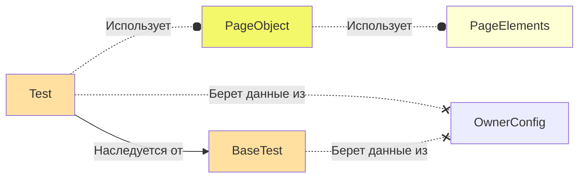

      

<h1>В проекте реализованы тесты для сайта Pikabu</h1>
Проект создан в рамках обучения в школе QA.GURU и представляет из себя часть выпускной работы.
  
## Оглавление
+ [Стек проекта](#projectStack)
+ [Архитектура проекта](#projectArchitecture)
+ [Запуск тестов](#runningTests)
    + [Запуск тестов локально](#runningTestsLocal)
    + [Запуск тестов в Jenkins](#runningTestsJenkins)
+ [Результаты](#results)
  + [Allure отчет о прохождении тестов](#resultsAllure)
  + [Результаты тестирования в TMS](#resultInTms)
  + [Результаты в Jira](#resultsInJira)
  + [Сценарии тестирования в TMS](#testCaseInTms)
  + [Уведомления](#resultNotification)
  + [Видео прохождения тестов](#resultVideo)

    
<h2><a name='projectStack'>:cookie:Стек проекта:</a></h2>

    
    
    
    
    
    
    
    

<ul>
	<li>Java - используется как основной язык для написания тестов</li>
	<li>Gradle - используется для сборки проекта</li>
	<li>Junit5 - тестовый фремворк</li>
	<li>Selenide - библиотека для работы с UI элементами страницы</li>
	<li>Allure - для формирования отчетов</li>
	<li>Jenkins - используется для запуска тестов</li>
	<li>Selenoid - используется для создания контейнеров для прохождения тестов</li>
	<li>AllureTestOps - система управления тестовыми сценариями</li>
</ul>

<h2>:cookie:<a name='projectArchitecture'>Архитектура проекта</a></h2>
Архитектура проекта состоит из 5 основных модулей
<ol>
    <li>
        <b>OwnerConfig</b> - конфигурационные файлы проекта, в которых может содержаться информация о среде выполнения теста и данные необходимые для работы теста.
        Данные для конфига берутся из .properties файла в ресурсах проекта, а так же из параметров запущенного теста.
    </li>
    <li>
        <b>BaseTest</b> - базовый класс с конфигурацией от которого наследуются все классы с тестами. Содержит методы BeforeEach и AfterEach.
    </li>
    <li>
        <b>Test</b> - класс описывающий логику работы теста основываясь на бизнесс требованиях.
    </li>
    <li>
        <b>PageObjects</b> - класс для описания страницы приложения. Поля класса объявляются как приватные константы и описывают селекторы для необходимых элементов.
        Взаимодействие с классом происходит за счет публичных методов класса, использующих ранее описанные селекторы.
    </li>
    <li>
        <b>PageElements</b> - класс для описания логики работы с часто используемыми элементами страницы. (ComboBox, Calendar...)
    </li>
</ol>

<h2>:cookie:<a name='runningTests'>Запуск тестов</a></h2>

<h3>:cookie:<a name='runningTestsLocal'>Запуск тестов локально</a></h3>

Для запуска тестов локально используется команда : <b>gradle clean parallelRegress</b>

<b>-DforkCount</b> - количество потоков для запуска теста

<b>-Dbrowser</b> - браузер для запуска теста

Для работы тестов подразумевающих авторизацию в системе нужно дополнительно указать параметры:

<b>-Dlogin</b> - логин для Pikabu

<b>-Dpassword</b> - пароль для Pikabu

P.S. Либо прописать их в конфигурационном файле <b>resources/config/userConfig.properties</b>

Так же необходимо указать токен бота и чат в который должны приходить уведомление в телеграмм. Для этого нужно
отредактировать файл: <b>notifications/telegram.json</b>

<h3>:cookie:<a name='runningTestsJenkins'>Запуск тестов в Jenkins</a></h3>
В качестве CI для тестов используется Jenkins, запуск тестов осуществляется в контейнерах Selenoid.

Для запуска тестов нужно создать параметризированную джобу. 

1. В качестве параметров были выбраны

<b>-DforkCount</b> - количество потоков для запуска теста

<b>-Dbrowser</b> - браузер для запуска теста

2. По результатам прохождения тестов формируются Allure отчет, а так же происходит интеграция результатов в TMS AllureTestOps

    

<h2>:cookie:<a name='results'>Результаты</a></h2>
<h3>:cookie:<a name='resultsAllure'>Allure отчет о прохождении тестов</a></h3>
На освнове результатов тестов формируется красивый Allure отчет. По которому можно посмотреть как прошли тесты и быстро определить
где была ошибка в случае ее обнаружения.

    
    

<h3>:cookie:<a name='resultsInTms'>Результаты в TSM</a></h3>
После прохождения тестов, результаты автоматически имопртируются в TMS, где их может посмотреть любой участник команды.

    

<h3>:cookie:<a name='resultsInJira'>Результаты в Jira</a></h3>
Результаты из TMS имопртируются в задачу Jira

    

<h3>:cookie:<a name='testCaseInTms'>Сценарии тестирования в TMS</a></h3>
На освное написанных тестов, в системе управления тестовыми сценариями автоматически были созданы тест кейсы для пройденных тестов.

    

<h3>:cookie:<a name='resultNotification'>Уведомления</a></h3>
Чтобы узнавать о результатах прохождения тестов, не обязательно постоянно следить за тестпланом в TMS или джобой в Jenkins.
В проекте настроены уведомления в телеграм, при помощи библиотеки <b>https://github.com/qa-guru/allure-notifications</b>

    

<h3>:cookie:<a name='resultVideo'>Видео прохождения тестов</a></h3>

    

